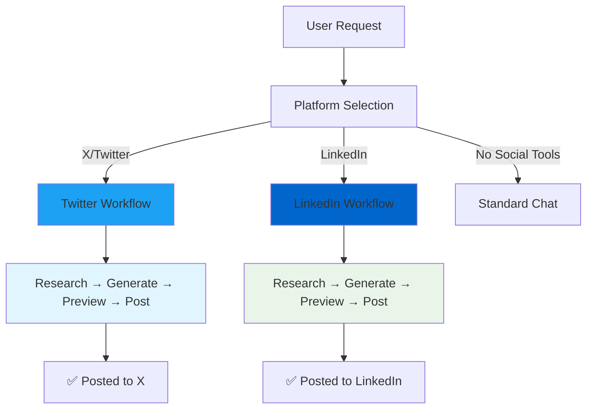

# Lazy Posts

🚀 **Blazingly Fast Social Media Automation** - Built on the popular T3Chat framework, Lazy Posts automates research, generation, and posting of content to X (formerly Twitter) and LinkedIn.

## 🎯 What is Lazy Posts?

Lazy Posts transforms the T3Chat interface into a powerful social media automation tool. Simply ask for a topic and watch as intelligent agents:
1. **Research** current information using web search
2. **Generate** platform-specific content (opinionated tweets for X, professional posts for LinkedIn)
3. **Preview** content in authentic platform-style cards
4. **Post** to your chosen social platform with one click

## ✨ Key Features

### 🤖 **Two-Agent Architecture**
- **Research Agent**: Uses OpenAI's web search to gather current, platform-relevant information
- **Synthesis Agent**: Creates platform-specific content (opinionated tweets for X, professional posts for LinkedIn)

### 🔍 **Smart Research**
- Real-time web search integration
- Source verification with clickable chips
- Expandable research findings accordion
- No more outdated information in your tweets

### 📱 **Platform-Native Experience**
- **X/Twitter**: Authentic Twitter post cards with opinionated, engaging content
- **LinkedIn**: Professional post cards with thought-leadership content and proper paragraph spacing
- Preview-then-post workflow for safety across both platforms
- "Post to Platform" → "View on Platform" button transitions
- Direct post URLs with correct URN formatting for LinkedIn
- Source links displayed as verification chips

### 🛠️ **Built on T3Chat**
- Multi-AI provider support (OpenAI, Anthropic, Google, Groq)
- Modern Next.js 15 + React 19 architecture
- Real-time streaming responses
- Persistent chat threads

## 🏗️ Architecture



### Agent Orchestration

**Agent 1 - Research Agent (Platform-Aware)**
```typescript
// Twitter Research - Focus on trends and viral content
const twitterResearch = await generateText({
  tools: { web_search_preview: openai.tools.webSearchPreview() },
  system: "Research agent for current information gathering"
});

// LinkedIn Research - Focus on business insights
const linkedinResearch = await generateText({
  tools: { web_search_preview: openai.tools.webSearchPreview() },
  system: "Professional research agent specializing in LinkedIn content"
});
```

**Agent 2 - Platform-Specific Synthesis**
```typescript
// Twitter Synthesis - Opinionated & Engaging
const twitterPost = await generateText({
  system: "Create opinionated Twitter post, under 280 chars, no hashtags"
});

// LinkedIn Synthesis - Professional & Thought Leadership
const linkedinPost = await generateText({
  system: "Create professional LinkedIn post with proper paragraph spacing (\\n\\n)"
});
```

## 🚀 Quick Start

### Prerequisites

- Node.js 18+
- OpenAI API key (for web search and synthesis)
- Composio API key (for social media integrations)
- Twitter OAuth app configured in Composio (for X integration)
- LinkedIn OAuth app configured in Composio (for LinkedIn integration)

### Installation

1. **Clone the repository**:
```bash
git clone <repository-url>
cd lazy-posts
```

2. **Install dependencies**:
```bash
npm install
```

3. **Set up environment variables**:
```bash
cp .env.example .env.local
```

Edit `.env.local`:
```bash
# Required for core functionality
OPENAI_API_KEY=your_openai_key

# Social Media Integration
COMPOSIO_API_KEY=your_composio_key           # For Twitter/X
COMPOSIO_AUTH_CONFIG_ID=your_twitter_config  # Twitter OAuth config
COMPOSIO_LINKEDIN_API_KEY=your_composio_key  # For LinkedIn  
LINKEDIN_AUTH_CONFIG_ID=your_linkedin_config # LinkedIn OAuth config

# Optional: Additional AI providers
ANTHROPIC_API_KEY=your_anthropic_key
GOOGLE_GENERATIVE_AI_API_KEY=your_google_key
GROQ_API_KEY=your_groq_key
```

4. **Configure Social Media OAuth in Composio**:
   - Visit [Composio Dashboard](https://app.composio.dev)
   - Set up Twitter integration with OAuth (for X/Twitter posting)
   - Set up LinkedIn integration with OAuth (for LinkedIn posting) 
   - Copy your API keys and config IDs to `.env.local`

5. **Run the development server**:
```bash
npm run dev
```

6. **Open [http://localhost:3000](http://localhost:3000)**

## ⚡ Usage

### Single-Platform Selection (Radio Button Design)
1. **Choose Your Platform**: Click the tools icon and select either:
   - **"X.com"** for Twitter/X posting with opinionated, engaging content
   - **"LinkedIn"** for professional networking with thought-leadership posts  
   - **"No Social Tools"** for regular AI chat without posting

2. **Authenticate**: Connect your chosen platform account via OAuth

3. **Request Content**: Type platform-appropriate requests:
   - **For X**: "Research AI trends and create a tweet" 
   - **For LinkedIn**: "Research market trends and create a professional LinkedIn post"

4. **Review**: Watch the research process and preview the generated content

5. **Post**: Click "Publish to [Platform]" to publish, then "View on [Platform]" to see it live

### Example Prompts

**For X/Twitter** (Opinionated & Engaging):
- "Research the latest AI developments and create a provocative tweet"
- "Find space exploration news and post an opinionated take to Twitter"
- "Look up climate change data and create an engaging tweet"

**For LinkedIn** (Professional & Thought Leadership):
- "Research industry AI trends and create a professional LinkedIn post"
- "Find business insights about remote work and share on LinkedIn"
- "Research market developments and create thought-leadership content"

## 🛠️ Model Compatibility

### ✅ Recommended Models (Tool Calling Support)
- **OpenAI**: GPT-4o-mini, GPT-4.1-mini, GPT-5, O3
- **Anthropic**: Claude 4 Sonnet, Claude 3.5 Sonnet
- **Google**: Gemini 2.5 Pro, Gemini 2.0 Flash

### ⚠️ Edge Cases
- **GPT-4o-mini**: Excellent for synthesis, requires explicit tool choice
- **GPT-4.1-mini**: Fast and cost-effective, perfect for both agents
- **Claude models**: Great reasoning, may need prompt adjustments
- **Gemini**: Strong research capabilities, variable Twitter API compatibility

## 🔧 Technical Details

### Frontend Architecture
- **Next.js 15** with React 19 Server Components
- **TypeScript** for full type safety
- **Zustand** for Twitter authentication state
- **TailwindCSS** for responsive design

### Backend Integration
- **Vercel AI SDK** with multiple provider support
- **OpenAI Tools** for web search functionality
- **Composio SDK** for Twitter API integration
- **Two-agent workflow** for research and synthesis

### Key Components
- `TwitterPostCard.tsx` - Authentic Twitter-style preview cards
- `LinkedInPostCard.tsx` - Professional LinkedIn-style preview cards with user profile data
- `TwitterStatus.tsx` / `LinkedInStatus.tsx` - Platform-specific OAuth flows
- `/api/chat/route.ts` - Platform-aware two-agent orchestration
- `/api/twitter/post/route.ts` - Tweet publishing with X.com URLs
- `/api/linkedin/post/route.ts` - LinkedIn publishing with urn:li:share URLs

## 🐛 Troubleshooting

### Common Issues

**Tool calling not working?**
- Ensure you're using a model that supports tool calling
- Try GPT-4o-mini or GPT-4.1-mini for best results
- Check console logs for tool execution traces

**Social media authentication failing?**
- **Twitter**: Verify Composio Twitter app configuration and COMPOSIO_API_KEY
- **LinkedIn**: Verify LinkedIn OAuth setup and COMPOSIO_LINKEDIN_API_KEY  
- Check OAuth redirect URLs match your domain
- Ensure all API keys and config IDs are correctly set
- Try single-platform selection to avoid user ID conflicts

**Sources not appearing?**
- Verify OpenAI API key has access to web search
- Check browser console for source extraction logs
- Try with a different model if issues persist

## 🆕 Latest Updates

### LinkedIn Integration (v2.0)
- ✅ **Professional Content Generation**: AI creates thought-leadership posts suitable for business networks
- ✅ **Proper Paragraph Spacing**: Content includes double line breaks (\n\n) for better readability  
- ✅ **User Profile Integration**: LinkedIn posts display actual user name, email, and profile picture
- ✅ **Correct Post URLs**: Proper `urn:li:share:` format for direct LinkedIn post links
- ✅ **Single-Platform Selection**: Radio button design prevents user ID conflicts between platforms
- ✅ **Business-Focused Research**: LinkedIn research agent focuses on industry trends and professional insights

### Architecture Improvements
- ✅ **Platform-Aware Agents**: Different system prompts for X (opinionated) vs LinkedIn (professional)
- ✅ **User ID Routing**: Correct authentication context based on selected platform
- ✅ **Enhanced Error Handling**: Better debugging and API response parsing
- ✅ **TypeScript Safety**: Full type safety across LinkedIn integration components

## 📊 Available Scripts

```bash
npm run dev      # Start development server
npm run build    # Build for production  
npm run start    # Start production server
npm run lint     # Run ESLint
```

## 🤝 Contributing

1. Fork the repository
2. Create a feature branch (`git checkout -b feature/amazing-feature`)
3. Commit your changes (`git commit -m 'Add amazing feature'`)
4. Push to the branch (`git push origin feature/amazing-feature`)
5. Open a Pull Request

## 📄 License

MIT License - see [LICENSE](LICENSE) file for details.

## 🙏 Acknowledgments

### Built On
- **[T3Chat](https://github.com/t3dotgg/t3-chat)** - The blazingly fast chat interface that inspired this project
- **[T3 Stack](https://create.t3.gg)** - Modern web development stack
- **[Composio](https://composio.dev)** - Powerful tool integration platform

### AI Providers
- **[OpenAI](https://openai.com)** - GPT models and web search tools
- **[Anthropic](https://anthropic.com)** - Claude models for synthesis
- **[Google AI](https://ai.google.dev)** - Gemini models
- **[Groq](https://groq.com)** - Lightning-fast inference

### Framework & Tools
- **[Next.js](https://nextjs.org)** - React framework for production
- **[TailwindCSS](https://tailwindcss.com)** - Utility-first CSS framework  
- **[Vercel AI SDK](https://sdk.vercel.ai)** - AI application development toolkit

---

**Lazy Posts** - *Research. Generate. Post. Repeat.* 🐦✨