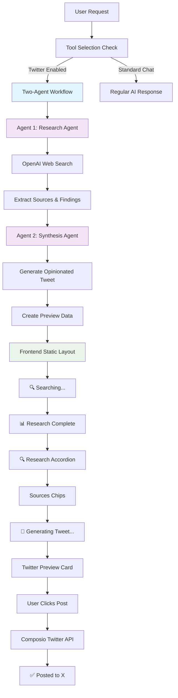

# Lazy Posts

🚀 **Blazingly Fast Twitter Automation** - Built on the popular T3Chat framework, Lazy Posts automates research, generation, and posting of tweets on X (formerly Twitter).

## 🎯 What is Lazy Posts?

Lazy Posts transforms the T3Chat interface into a powerful Twitter automation tool. Simply ask for a topic and watch as intelligent agents:
1. **Research** current information using web search
2. **Generate** opinionated, engaging tweets based on findings
3. **Preview** tweets in authentic Twitter-style cards
4. **Post** to your X account with one click

## ✨ Key Features

### 🤖 **Two-Agent Architecture**
- **Research Agent**: Uses OpenAI's web search to gather current information
- **Synthesis Agent**: Creates opinionated, engaging tweets from research findings

### 🔍 **Smart Research**
- Real-time web search integration
- Source verification with clickable chips
- Expandable research findings accordion
- No more outdated information in your tweets

### 📱 **Twitter-Native Experience**
- Authentic Twitter post cards for previews
- Preview-then-post workflow for safety
- "Post to Twitter" → "View on X" button transition
- Source links displayed as verification chips

### 🛠️ **Built on T3Chat**
- Multi-AI provider support (OpenAI, Anthropic, Google, Groq)
- Modern Next.js 15 + React 19 architecture
- Real-time streaming responses
- Persistent chat threads

## Demo

[Watch the video]((https://www.loom.com/share/8667b968450a43f89681498aa29b2dc1?sid=82682afd-fa76-4a01-b04a-f4932ec935d7)


## 🏗️ Architecture



### Agent Orchestration

**Agent 1 - Research Agent**
```typescript
const researchResult = await generateText({
  model,
  tools: {
    web_search_preview: openai.tools.webSearchPreview()
  },
  toolChoice: { type: 'tool', toolName: 'web_search_preview' },
  system: "Research agent for current information gathering"
});
```

**Agent 2 - Synthesis Agent**
```typescript
const tweetResult = await generateText({
  model,
  system: "Create opinionated Twitter post based on research findings",
  messages: [{
    role: "user",
    content: `RESEARCH FINDINGS:\n${researchResult.text}`
  }]
});
```

## 🚀 Quick Start

### Prerequisites

- Node.js 18+
- OpenAI API key (for web search and synthesis)
- Composio API key (for Twitter integration)
- Twitter OAuth app configured in Composio

### Installation

1. **Clone the repository**:
```bash
git clone <repository-url>
cd lazy-posts
```

2. **Install dependencies**:
```bash
npm install
```

3. **Set up environment variables**:
```bash
cp .env.example .env.local
```

Edit `.env.local`:
```bash
# Required for core functionality
OPENAI_API_KEY=your_openai_key
COMPOSIO_API_KEY=your_composio_key
COMPOSIO_AUTH_CONFIG_ID=your_composio_config_auth_id

# Optional: Additional AI providers
ANTHROPIC_API_KEY=your_anthropic_key
GOOGLE_GENERATIVE_AI_API_KEY=your_google_key
GROQ_API_KEY=your_groq_key
```

4. **Configure Twitter OAuth in Composio**:
   - Visit [Composio Dashboard](https://app.composio.dev)
   - Set up Twitter integration with OAuth
   - Copy your API key to `.env.local`

5. **Run the development server**:
```bash
npm run dev
```

6. **Open [http://localhost:3000](http://localhost:3000)**

## ⚡ Usage

1. **Enable Twitter Tools**: Click the tools icon and enable "X.com"
2. **Authenticate**: Connect your Twitter account via OAuth
3. **Request a Tweet**: Type something like "Research AI trends and create a tweet"
4. **Review**: Watch the research process and preview the generated tweet
5. **Post**: Click "Post to Twitter" to publish, then "View on X" to see it live

### Example Prompts
- "Research the latest developments in AI and post to Twitter"
- "Find current space exploration news and create an engaging tweet"
- "Look up recent climate change data and tweet about it"
- "Research cryptocurrency trends and post an opinionated take"

## 🛠️ Model Compatibility

### ✅ Recommended Models (Tool Calling Support)
- **OpenAI**: GPT-4o-mini, GPT-4.1-mini, GPT-5, O3
- **Anthropic**: Claude 4 Sonnet, Claude 3.5 Sonnet
- **Google**: Gemini 2.5 Pro, Gemini 2.0 Flash

### ⚠️ Edge Cases
- **GPT-4o-mini**: Excellent for synthesis, requires explicit tool choice
- **GPT-4.1-mini**: Fast and cost-effective, perfect for both agents
- **Claude models**: Great reasoning, may need prompt adjustments
- **Gemini**: Strong research capabilities, variable Twitter API compatibility

## 🔧 Technical Details

### Frontend Architecture
- **Next.js 15** with React 19 Server Components
- **TypeScript** for full type safety
- **Zustand** for Twitter authentication state
- **TailwindCSS** for responsive design

### Backend Integration
- **Vercel AI SDK** with multiple provider support
- **OpenAI Tools** for web search functionality
- **Composio SDK** for Twitter API integration
- **Two-agent workflow** for research and synthesis

### Key Components
- `TwitterPostCard.tsx` - Authentic Twitter-style preview cards
- `TwitterStatus.tsx` - OAuth authentication flow
- `/api/chat/route.ts` - Two-agent orchestration
- `/api/twitter/post/route.ts` - Tweet publishing endpoint

## 🐛 Troubleshooting

### Common Issues

**Tool calling not working?**
- Ensure you're using a model that supports tool calling
- Try GPT-4o-mini or GPT-4.1-mini for best results
- Check console logs for tool execution traces

**Twitter authentication failing?**
- Verify Composio Twitter app configuration
- Check OAuth redirect URLs match your domain
- Ensure API keys are correctly set

**Sources not appearing?**
- Verify OpenAI API key has access to web search
- Check browser console for source extraction logs
- Try with a different model if issues persist

## 📊 Available Scripts

```bash
npm run dev      # Start development server
npm run build    # Build for production  
npm run start    # Start production server
npm run lint     # Run ESLint
```

## 🤝 Contributing

1. Fork the repository
2. Create a feature branch (`git checkout -b feature/amazing-feature`)
3. Commit your changes (`git commit -m 'Add amazing feature'`)
4. Push to the branch (`git push origin feature/amazing-feature`)
5. Open a Pull Request

## 📄 License

MIT License - see [LICENSE](LICENSE) file for details.

## 🙏 Acknowledgments

### Built On
- **[T3Chat](https://github.com/t3dotgg/t3-chat)** - The blazingly fast chat interface that inspired this project
- **[T3 Stack](https://create.t3.gg)** - Modern web development stack
- **[Composio](https://composio.dev)** - Powerful tool integration platform

### AI Providers
- **[OpenAI](https://openai.com)** - GPT models and web search tools
- **[Anthropic](https://anthropic.com)** - Claude models for synthesis
- **[Google AI](https://ai.google.dev)** - Gemini models
- **[Groq](https://groq.com)** - Lightning-fast inference

### Framework & Tools
- **[Next.js](https://nextjs.org)** - React framework for production
- **[TailwindCSS](https://tailwindcss.com)** - Utility-first CSS framework  
- **[Vercel AI SDK](https://sdk.vercel.ai)** - AI application development toolkit

---

**Lazy Posts** - *Research. Generate. Post. Repeat.* 🐦✨
